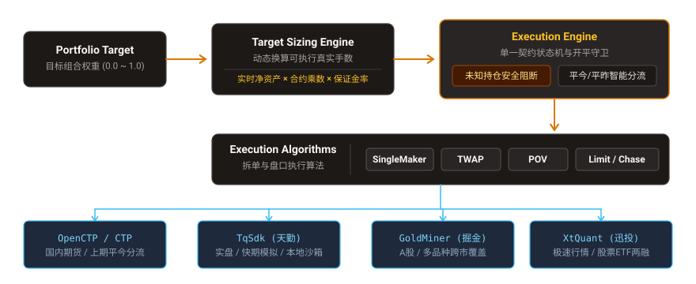
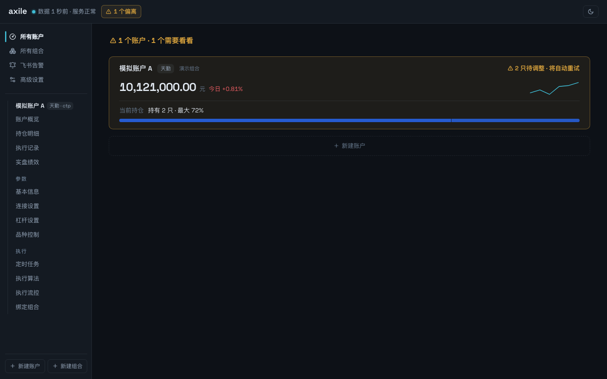
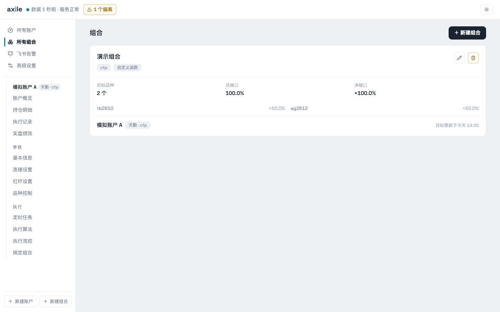
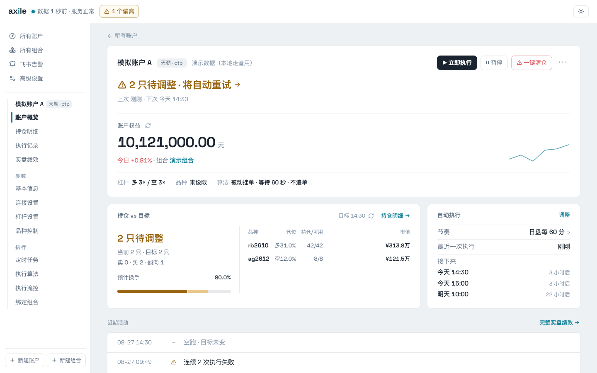
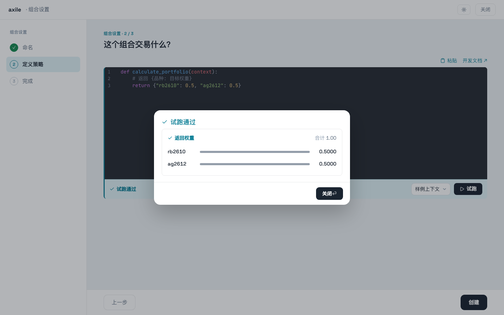

# Axile (算法交易执行服务)

<p align="center">
  
</p>

<p align="center">
  <b>专注于量化投资组合落地实盘的确定性算法交易执行引擎与资产守护服务</b>
  <br>
  <span>多渠道柜台统一适配 · 动态组合调仓换算 · 未知持仓安全守卫 · 估值容错与对账审计</span>
</p>

<p align="center">
  
  
  
  
  
</p>

---

## 💡 为什么需要 Axile？

在量化投研从“回测代码”走向“真金白银实盘”的过程中，研究员通常面临一系列非投研核心却极其致命的工程与资金安全痛点：

* ❌ **持仓未知导致误平仓**：柜台断线、超时或查持仓失败时，部分系统误将持仓当成 0 处理，触发致命的反向开仓或错误平仓。
* ❌ **权重与手数换算繁琐**：目标权重（如各品种分配 10%）如何根据账户实时动态权益、保证金率、合约乘数及最小跳价安全换算为可执行真实手数？
* ❌ **各交易柜台规则割裂**：CTP 烦琐的平今/平昨区分（上期所平今必须使用 `CloseToday`）、天勤合约代码转换、掘金/迅投 API 差异，导致执行算法无法复用。
* ❌ **盘后或茶歇净值击穿**：非交易时段无盘口推送，导致账户持仓市值被归零，引发风控误报警或回测净值曲线断崖。

**Axile** 正是为彻底解决上述落地摩擦而生。它充当投研算法与底层柜台之间坚固的**执行防火墙与调度操作系统**。

---

## 🏛️ 核心架构与设计细节

Axile 遵循**单回环安全模型（Local Loopback Only）**与**只读证据链**设计原则：

### 1. 目标换算与执行管线 (Pipeline)
* **Target Sizing 动态换算**：接入组合目标权重输入后，实时对齐柜台动态权益，结合各合约乘数、最新价与保证金率换算为实际可执行手数。即使处于时段阻断状态，依然计算目标偏离度以供对账。
* **单一契约与未知持仓守卫**：全系统严格执行统一 `status` 与 `error` 契约。若持仓同步超时或处于 `UNKNOWN` 状态，执行器**坚决阻断**，不猜测、不下单，绝不误判为 0。
* **开平智能拆解**：针对国内期货规则，内置上期所/能源中心平今优先（`CloseToday`）与其他交易所平昨自动路由，彻底杜绝“仓位不足/平仓指令错误”拒单。

### 2. 多渠道适配层 (Channel Adapters)
| 渠道 (Channel) | 接入技术 | 适用市场与特性 | 依赖安装方式 |
| :--- | :--- | :--- | :--- |
| **OpenCTP / CTP** | C++ 原生封装 / IPC | 国内商品期货与股指期权，支持平今平昨自动分流 | `uv sync --extra ctp` |
| **TqSdk (天勤)** | 天勤官方 SDK | 期货实盘、快期模拟与内存级本地沙箱 | `uv sync --extra tqsdk` |
| **GoldMiner (掘金)** | GM SDK | A股、ETF 及多品种跨市场策略执行（支持 Linux/Win） | `uv sync --extra gm` |
| **XtQuant (迅投 QMT)** | XtQuant 客户端组件 | 券商极速柜台接入，支持股票与两融 | 独立集成 |

### 3. 持仓估值多级容错与对账 (Valuation Fallback)
为了避免盘后结算、休市与茶歇期间行情缺失导致账户资产失真，Axile 实施**报单盘口校验**与**盯市估值链**完全解耦：
* **下单时**：严格要求双边买卖盘口实时且新鲜，超时立即拒绝；
* **估值时**：活跃品种共享 3 秒 Tick 聚合；非交易时段平滑降级取最近成交价（`LastPrice`）；若推送缺失，自动触发单合约 `ReqQryDepthMarketData` 点查补全；并通过 Alembic 0014 安全回填历史证据。

### 4. 统一 Clock 依赖注入与交易日历投影
* 全系统时间读取与延时统一收敛至 `Clock` 抽象（`RealClock` 与 `SimClock`），使生产执行与虚拟仿真无缝互换。
* 内置国内期货与 A 股开闭市日历（`ScheduleClock`），前端绩效收益曲线支持在**等距观测点序列**与**自然日历时间轴**间切换，完美处理长假与周末跳空。

### 5. 内置 Python IDE 策略工作台
内置基于 `@codemirror/lsp-client` 与 `ty server` 语言服务的策略编辑器，提供类型诊断、代码补全、文档 Hover、定义跳转及代码折叠。每个工作区采用独立临时子进程沙箱隔离，源码只读预览防篡改。

---

## 🖥️ Web UI 系统全貌

Axile 提供了开箱即用的专业暗色/明色量化控制台：

| 资产总览仪表盘 | 组合配置与可执行目标 |
| :---: | :---: |
|  |  |
| **账户活动流与执行详情** | **策略调仓与清仓算法运行** |
|  |  |

---

## 🚀 快速开始与部署说明

### 环境要求
* **Python**：`3.12+`
* **包管理器**：[uv](https://docs.astral.sh/uv/)（推荐极速构建）
* **前端运行时**：[Bun](https://bun.sh/)（用于编译 Web 界面）

### 1. 克隆与依赖安装
```bash
git clone https://github.com/zengbin93/axile.git
cd axile

# 根据你需要的柜台渠道，安装核心及扩展依赖：
# 基础安装：
uv sync

# 如果需要国内期货 CTP 渠道：
uv sync --extra ctp

# 如果需要天勤 TqSdk 渠道：
uv sync --extra tqsdk

# 如果需要掘金 GM 渠道（Windows x86_64 或 Linux x86_64）：
uv sync --extra gm

# 或一次性安装全量渠道（除特定平台限制外）：
uv sync --all-extras
```

### 2. 编译前端静态资源
```bash
cd ui
bun install
bun run build
cd ..
```

### 3. 初始化配置与启动服务
```bash
# 复制示例配置文件
cp example.config.toml config.toml

# 启动 Axile 执行服务（默认运行在 127.0.0.1:8000）
uv run axile
```

启动完成后，打开浏览器访问：👉 **<http://127.0.0.1:8000>**

---

## 🔒 安全边界说明

* **仅限本地单用户使用**：Axile 专为单机运行设计，不提供应用层用户鉴权体系。服务端和 Web 控制台**严禁**监听 `0.0.0.0`，且不得直接通过端口映射或反向代理暴露到公网。
* **交易日历约定**：内置基于 Shinny 的交易日历事实，每日 `00:00` 自动物化国内期货与 A 股开市状态。如果涉及特殊交易所调休，可通过自定义函数或配置重载。
* **天勤模拟模式注意**：本地模拟状态随日盘、夜盘常驻 Worker 重建而重置。若需要保留连续长周期的持久模拟状态，请在配置中选用快期模拟。

---

## 📚 详细文档

* [系统架构设计与执行拓扑细节全景 (HTML)](docs/architecture-design-details.html)
* [Python 策略编辑器与 LSP 工作台设计 (Markdown)](docs/python-editor.md)

---

## 📄 开源许可证

本项目基于 [Apache-2.0 License](LICENSE) 协议开源。
